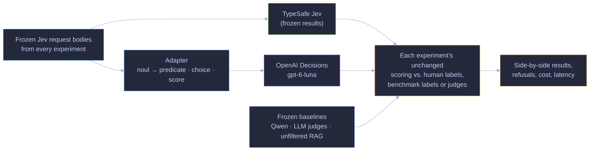

# Decision Model Testing

## Intro

General-purpose decision models (TypeSafe Jev, and the *many* more to follow) are a game changer.  They work like a fuzzy switch or a fuzzy scoring system that can be driven by natural language prompts (hence "fuzzy"), which is a significant part of how we use LLMs today in the knowledge and context engineering world.  LLMs are quite expensive for this kind of stuff!

But my question was, how good is Jev really?  Where is it already useful?  How can we begin empirically proving where it should replace LLMs today, and where future versions should replace LLMs tomorrow?

I've been experimenting daily to answer these questions for myself.  Many of my experiments are on private data, but not all.  This repo is where I'll share the latter set.

## Get to it already.

This repo contains exports of my experiments with general-purpose decision models (i.e. TypeSafe Jev).  Mostly I'm comparing them to the performance and cost of LLMs, NLP models, and specialized decision models (rerankers, etc.).

I'm not packing all the data into this public repo due to licensing questions, but my goal is to make reproduction straightforward.  The datasets are all freely available and I've included links to them where possible.

Each experiment is a self-contained subfolder of `experiments/`. On 2026-10-06 every one of them was also re-run on OpenAI's new Decisions API; see [OpenAI Decisions vs. Jev](#openai-decisions-vs-jev) below.

| Experiment | Research question | Status |
|---|---|---|
| [Decision models vs. LLM judges for evals](experiments/jev-vs-LLM-for-evals/README.md) | Can a decision model replace or front an LLM judge on standard judging benchmarks? | Complete; Decisions re-run complete |
| [Search-result filtering before Kimi K3](experiments/jev-search-result-narrower/README.md) | Does filtering retrieved chunks with a decision model cut RAG answering cost without hurting answers? | Complete; Decisions re-run complete |
| [Search-result filtering before Claude](experiments/jev-search-result-narrower-claude-RAG/README.md) | Do probability and categorical filtering hold up before a stronger answering model? | Complete; Decisions re-run complete |
| [Decision models vs. rerankers](experiments/jev-vs-rerankers/README.md) | How well does a decision model order passages against human relevance judgments, compared with a dedicated reranker? | Complete; Decisions re-run complete |
| [Request shaping for decision models](experiments/request-shaping/README.md) | Should you pack items into one state, ask many questions per request, and where should evidence sit? | Complete on Jev and Decisions |
| [OpenAI Decisions adapter](experiments/openai-decisions-adapter/README.md) | How do Jev requests translate to OpenAI Decisions? (shared code, not a study) | Released |
| [Decision model to narrow web search results](https://github.com/dorkitude/webctl) | Can Jev trim search results, and their content, to the goal of the original query? | Grew into a reusable CLI (MIT-licensed) |

### Synopses

**[Decision models vs. LLM judges for evals](experiments/jev-vs-LLM-for-evals/README.md)** is a sort of eval-of-evals. It weighs Jev against four open LLM judges (GPT-OSS 120B, DeepSeek V4 Flash, GLM 5p3, Qwen3p8 Max) on LLMBar, JudgeBench and RewardBench 2, measuring agreement with benchmark labels, service failures, latency, tokens and list-price cost through one Go harness. After service-error retries Jev scored 87.36% on LLMBar Vanilla, 69.03% on JudgeBench vanilla and 68.12% on RewardBench 2 ratings, against 87.05%, 77.10% and 79.56% for GPT-OSS and up to 92.53%, 88.39% and 81.57% for Qwen, at a small fraction of their cost. An offline Jev → GPT-OSS cascade scored 80.12% on held-out JudgeBench vs. 76.41% for GPT-OSS alone at 43.69% lower cost. **On OpenAI Decisions** the same requests scored 79.16%, 23.87% and 61.32%: it picked the first-shown response in both presentation orders on 71% of JudgeBench vanilla pairs, it refused 159 RewardBench 2 requests, and no Decisions-first cascade beat its fallback. It did beat Jev on all five LLMBar rating methods (+1.2 to +5.1 points).

**[Search-result filtering before Kimi K3](experiments/jev-search-result-narrower/README.md)** asks Jev whether each retrieved EnronQA chunk is useful and passes only chunks with p ≥ 0.5 to Kimi K3, on 100 paired questions. The frozen run kept 307 of 2,020 chunks and cut estimated answering cost from $5.06 to $1.65, with DeepSeek accepting 98/100 answers in both arms. Because the frozen judge model was retired, all arms were re-judged by DeepSeek v4p1 for the **Decisions** re-run: 97 unfiltered, 96 Jev-filtered, 94 Decisions-filtered (Decisions − Jev −2 points [−5, 0]). Decisions kept 263 chunks, agreed with Jev on 95.6% of chunk decisions (κ 0.82), refused none, and cost $1.69 for the whole pipeline.

**[Search-result filtering before Claude](experiments/jev-search-result-narrower-claude-RAG/README.md)** repeats the filter before Claude Opus 5 on a disjoint 100-question sample, with a probability threshold and a categorical mode (direct / supporting / irrelevant). The frozen runs scored 96 (unfiltered), 95 (threshold) and 96 (categorical) of 100 under DeepSeek, with estimated cost falling from $26.91 to $6.21 and $7.44. Under the same DeepSeek v4p1 judge, **Decisions** matched Jev within one answer: 94 vs. 95 (threshold) and 94 vs. 94 (categorical), against 94 and 93 unfiltered, while returning fewer chunks (249 vs. 323; 313 vs. 421) and costing $5.15 and $5.98. The Decisions answers came through a different Claude subscription route, a confound stated in the README.

**[Decision models vs. rerankers](experiments/jev-vs-rerankers/README.md)** compares Qwen3 Reranker 8B with Jev probability, expected-grade and ordinal scores over the same 100 BM25 candidates for all 97 TREC DL 2019/2020 queries, scored by NIST human judgments. Qwen reached nDCG@10 0.6994 and Jev's expected grade 0.6917; a nine-prompt follow-up reached 0.6962. **On Decisions** the expected-grade request scored 0.7006, +0.0012 [−0.0207, +0.0226] vs. Qwen and +0.0089 vs. Jev; prompts did not transfer one for one, and one prompt lost 13 queries to refusals and BM25 fallback. Twelve Decisions arms cost $5.30 with a median request time of 0.12 s.

**[Request shaping for decision models](experiments/request-shaping/README.md)** runs three controlled studies on the same TREC passages: packing up to 100 passages into one state, asking up to 16 questions per request, and moving evidence through 10- or 40-passage states. On Jev, packing raised nDCG@10 by +0.036 at K = 100 while cutting tokens per decision from 438 to 189; co-asked questions were independent within retest noise (|Δp| 0.009); and position effects were small. **On Decisions** answers were fully deterministic (retest |Δp| 0.0000) and fan-out had exactly zero effect, but packing neither improved ranking significantly (+0.015) nor saved tokens, extra questions cost about 140 tokens each, and placing the question before a long state raised AUC from 0.85 to 0.90. All 100,672 requests cost $7.54 on Jev and $19.98 on Decisions.

**[OpenAI Decisions adapter](experiments/openai-decisions-adapter/README.md)** is the small, dependency-free Go package that translates a Jev request body into a Decisions request (noul → predicate, choice → choice, score → score), sends it, and converts the answers back into Jev's response shape, keeping refusals visible. It is what made the re-runs above byte-for-byte comparable.

**[Decision model to narrow web search results](https://github.com/dorkitude/webctl):** have Jev trim search results based on the goal of the original query; and have it trim the content too.  This one got out of hand, and I realized it was immediately useful to others anyway, so I made it into a reusable CLI (MIT-licensed)

## OpenAI Decisions vs. Jev

OpenAI released its [Decisions API](https://developers.openai.com/api/docs/guides/decisions) (`gpt-6-luna`, public beta, $0.10 per million input tokens) as another general-purpose decision model. Because it answers the same kinds of typed questions as Jev, every experiment above was re-run on 2026-10-06 by sending the **exact frozen Jev requests** through a [translation adapter](experiments/openai-decisions-adapter/README.md). Samples, prompts, scoring and baselines were held fixed; Jev and the baselines were not re-run.

| Experiment | Measure | Baseline | Jev | Decisions | Decisions refusals |
|---|---|---:|---:|---:|---:|
| Rerankers (expected grade) | nDCG@10 | Qwen 0.6994 | 0.6917 | **0.7006** | 0 |
| LLM judges, LLMBar Vanilla | strict agreement | GPT-OSS 87.05% | 87.36% | 79.16% | 0 |
| LLM judges, JudgeBench vanilla | strict agreement | GPT-OSS 77.10% | 69.03% | 23.87% | 0 |
| LLM judges, RewardBench 2 ratings | strict agreement | GPT-OSS 79.56% | 68.12% | 61.32% | 136 requests |
| Kimi RAG filter | accepted /100, same judge | 97 | 96 | 94 | 0 |
| Claude RAG filter, threshold | accepted /100, same judge | 94 | 95 | 94 | 0 |
| Claude RAG filter, categorical | accepted /100, same judge | 93 | 94 | 94 | 0 |
| Request shaping | retest mean \|Δp\| | n/a | 0.0094 | 0.0000 | 46 of 401,710 questions |

In short: Decisions is a strong relevance scorer and a reasonable RAG filter, is deterministic, and answers in about 0.12 s, but it is a poor pairwise judge under these prompts because of a strong first-position bias, it occasionally refuses, and its list price is about 2.4× Jev's per input token. Each experiment's README has a dated "OpenAI Decisions re-run" section with intervals, costs, latency and caveats.

This distribution contains code, original prompts, synthetic tests and aggregate measurements. Datasets, source-bearing answers/receipts, archives, private correspondence and prior Git history are excluded.

See [reproduction and limits](REPRODUCTION.md) and [third-party notices](THIRD_PARTY_NOTICES.md).
