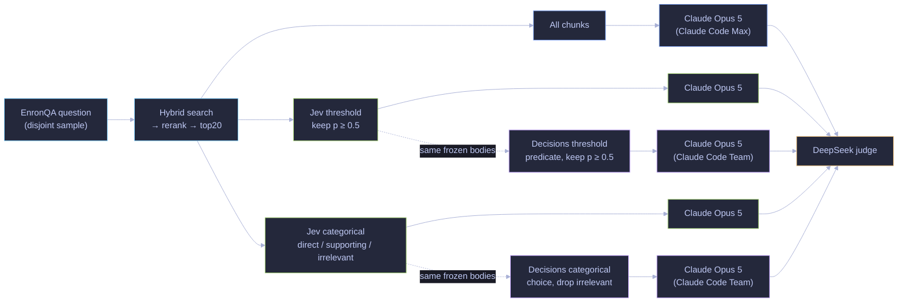
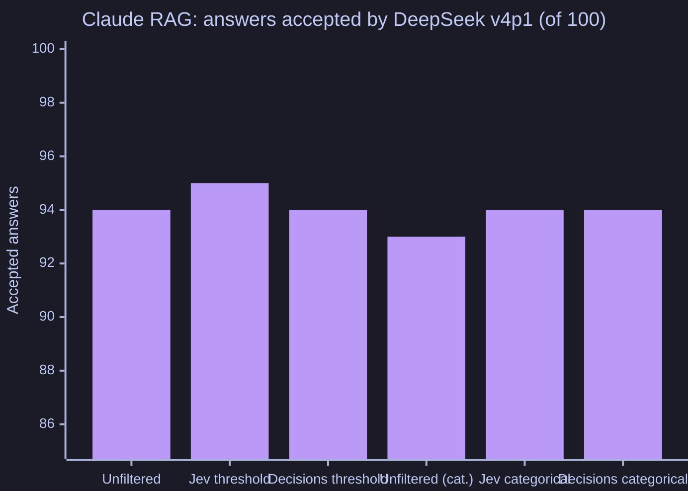

# Claude RAG filtering

Jev filters top20 reranked search results before Claude Opus 5 answers through Claude Code Max. The baseline gets all chunks; treatments keep probability ≥0.5 or categories `direct_evidence` and `supporting_evidence` (discard `irrelevant`). Categorical mode uses no numerical cutoff. Whole chunks are paged under 6,000 proxy tokens, 24,000 bytes and six decisions.

| Pipeline | DeepSeek accepted /100 | Estimated model cost | Mean time to final answer |
|---|---:|---:|---:|
| Unfiltered | 96 | $26.91 | 5.93 s |
| Jev threshold | 95 | $6.21 | 4.89 s |
| Jev categorical | 96 | $7.44 | 5.38 s |

Costs cover answering, filtering, embedding and reranking; exclude judging, indexing and infrastructure. Claude costs are API-equivalent estimates, not incremental Max charges. Timing begins at the first Claude invocation and includes CLI startup and intervening searches; it excludes initial retrieval/filtering and grading. Categorical comparison reuses historical controls on an inspected sample; outcomes do not establish superiority. Two question workers were used. The sample differs from Kimi's, so this is not a controlled model comparison.

## How it works

All arms share retrieval. The threshold arm keeps chunks by probability; the categorical arm discards only `irrelevant` and has no numerical cutoff. The dotted branches are the [OpenAI Decisions re-run](#openai-decisions-re-run-2026-10-06), which sends the same frozen Jev filter requests to Decisions.

## OpenAI Decisions re-run (2026-10-06)

**What changed and what was held fixed.** Only the filter changed. The frozen Jev filter requests of both modes were sent unchanged to OpenAI's [Decisions API](https://developers.openai.com/api/docs/guides/decisions) (`gpt-6-luna`) through the [adapter](../openai-decisions-adapter/README.md): threshold-mode Noul questions became predicates (keep p ≥ 0.5) and categorical-mode questions became three-option choices (discard `irrelevant`). The 100 questions, cached searches, paging guards, Claude model and prompts, and judge prompt are the same. Claude Opus 5 answered from the Decisions-filtered evidence; the unfiltered and Jev arms are the frozen runs.

**Two caveats come first.** (1) *Claude route:* the new answers came through Claude Code on a Team subscription, the frozen ones through Claude Code Max. The model and prompts are the same, but any route effect is confounded with the filter effect. (2) *Judge:* the frozen DeepSeek judge model (`deepseek-v4-flash-0731`) has been retired, so all arms' answers were judged by `deepseek-v4p1-flash` with the frozen judge prompt and request shape. Only those same-judge numbers are compared below. On the frozen answers the two DeepSeek versions agreed 198 of 200 times in threshold mode (κ 0.89) and 195 of 200 in categorical mode (κ 0.75); every disagreement was frozen-correct, re-judged-incorrect.

| Pipeline | DeepSeek v4p1 accepted /100 | Chunks returned to Claude | Estimated model cost |
|---|---:|---:|---:|
| Unfiltered | 94 | all | $26.91 |
| Jev threshold (frozen) | 95 | 323 | $6.21 |
| **Decisions threshold** | **94** | 249 | $5.15 |
| Unfiltered (categorical-mode re-judge) | 93 | all | $26.91 |
| Jev categorical (frozen) | 94 | 421 | $7.44 |
| **Decisions categorical** | **94** | 313 | $5.98 |

The unfiltered answers are identical in both modes; each mode's re-judge judged them separately, and the v4p1 judge changed its verdict on 1 of the 100 (94 vs. 93). That is the scale of judge noise against which the one-point differences below should be read.

Paired differences under the same judge (cluster bootstrap by source document, 95%, descriptive): threshold mode, Decisions minus Jev −1 point [−3, 0] (Jev alone correct on 1 question) and Decisions minus unfiltered 0 [0, 0]; categorical mode, Decisions minus Jev 0 [−3, +3] (one question each way) and Decisions minus unfiltered +1 [−2, +5].

**Filter agreement.** On the 2,000 chunk decisions with inputs identical to the frozen runs, threshold mode agreed with Jev on 94.7% of keep/drop decisions (κ 0.78; probability correlation 0.91), keeping 249 vs. 322; categorical mode agreed on 92.3% (κ 0.74), keeping 311 vs. 420. In categorical mode Decisions moved most of Jev's `supporting_evidence` chunks to `irrelevant` (112 of 169). Source-document coverage of the initial search was 97 before and 96 of 100 after filtering in both modes.

**Decisions as the answer judge.** As a rescoring judge on the frozen answers (the [Jev rescore](results/jev-rescore-v1/summary.json) protocol, same 200 answers), Decisions accepted 89 unfiltered and 86 Jev-filtered answers. It agreed with the frozen DeepSeek verdicts on 184 of 200 (κ 0.50; all 16 disagreements were answers DeepSeek accepted and Decisions rejected), where Jev agreed on 178 of 200. It agreed with Jev's rescoring on 176 of 200 (κ 0.50). That run made 200 requests with 0 refusals, for $0.021.

**Refusals: 0** in either filtering mode (2,040 chunk decisions each) and 0 in rescoring. No request failed.

**Cost and latency.** The Decisions filter cost $0.19 (threshold, 415 pages) and $0.20 (categorical, 424 pages) at $0.10 per million input tokens. Because it returned fewer chunks, Claude read less: the whole Decisions-filtered pipeline came to $5.15 and $5.98 against $6.21 and $7.44 with the frozen Jev filters and $26.91 unfiltered. Claude costs are API-equivalent list estimates, not subscription charges. The answer stage (filtering, Claude and follow-up searches) took a median 3.1 s and 3.3 s against 5.1 s and 5.2 s for the frozen Jev arms, but on a different Claude route and day, so that difference is not attributable to the filter.

**Caveats.** 100 questions per mode; DeepSeek verdicts are model assessments, not human truth; the filter prompts were written for Jev; the Claude route changed. [Source-free aggregates](results/openai-decisions-v1/README.md).

## Reproduce

See [shared setup and limits](../../REPRODUCTION.md). From this directory, build with `go build ./...`, run synthetic checks with `go test ./...`, and inspect CLI help before any paid run. Numerical reports are under `results/`. No historical evidence download is required or available in this distribution.
