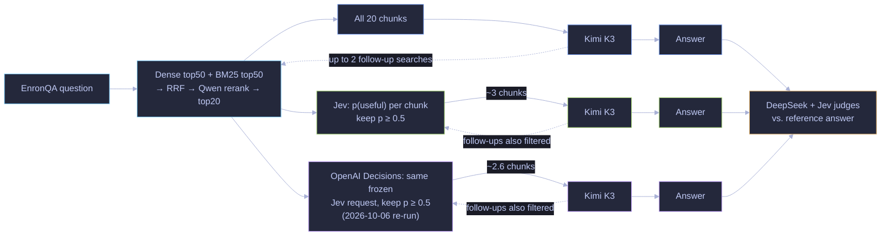
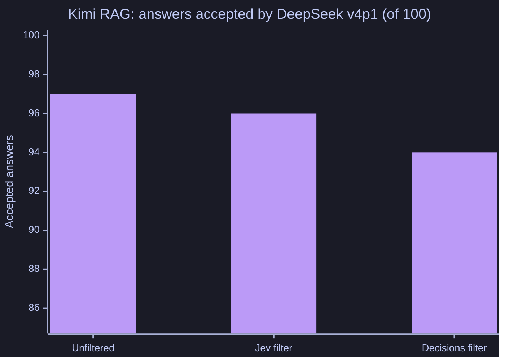

# Kimi RAG filtering

Jev scores retrieved chunks and returns only those with relevance probability ≥0.5 to Kimi K3. Dense top50 + BM25 top50 → RRF → Qwen rerank → top20. Both arms share initial retrieval; Kimi may make up to three searches. Whole chunks are paged under 6,000 proxy tokens, 24,000 bytes and six decisions.

On 100 paired questions, DeepSeek accepted 98/100 in both arms; Jev accepted 90/100 baseline and 94/100 filtered. Estimated answering-pipeline model cost fell from $5.0632 to $1.6509; 307/2020 chunks were retained. These are model judgments and list-price estimates, not human truth or invoices. Costs include answering, filtering, embedding and reranking; exclude judging, indexing and infrastructure.

| Pipeline | Mean question-to-final-answer time |
|---|---:|
| Unfiltered | 5.50 s |
| Jev filtered | 4.82 s |

Timing begins with the first Kimi request and ends with the final answer. It excludes initial retrieval/filtering and grading, includes intervening follow-up searches, and reflects eight concurrent question workers. This is observed speed, not a controlled latency comparison.

## How it works

The upper branch is the baseline; the middle branch adds Jev filtering; the lower branch is the [OpenAI Decisions re-run](#openai-decisions-re-run-2026-10-06). All share the initial retrieval. Chunk counts are observed means per result set (Jev 3.04, Decisions 2.6), not limits.

## OpenAI Decisions re-run (2026-10-06)

**What changed and what was held fixed.** Only the filter changed. The frozen Jev filter request for every result set, including follow-up searches, was sent unchanged to OpenAI's [Decisions API](https://developers.openai.com/api/docs/guides/decisions) (`gpt-6-luna`) through the [adapter](../openai-decisions-adapter/README.md); each chunk's Noul question became a predicate, and a chunk was kept when p ≥ 0.5, as for Jev. The 100 questions, cached initial searches, paging guards, Kimi K3 model and prompts, and judge prompts are the same. Kimi answered from the Decisions-filtered evidence (100 new answers); the baseline and Jev arms are the frozen run.

**Why everything was re-judged.** The frozen DeepSeek judge model (`deepseek-v4-flash-0731`) has been retired by its host, so the new answers could not be judged by it. To compare like with like, all three arms' saved answers were judged by `deepseek-v4p1-flash` with the frozen judge prompt and request shape (only the model changed). On the 200 frozen answers the two DeepSeek versions agreed 197 times (κ 0.72); the three disagreements were all frozen-correct, re-judged-incorrect.

| Pipeline | DeepSeek v4p1 accepted /100 (same judge, all arms) | Frozen DeepSeek /100 | Jev judge /100 | Chunks kept | Estimated model cost |
|---|---:|---:|---:|---:|---:|
| Unfiltered | 97 | 98 | 90 | all 20 per search | $5.06 |
| Jev filter (frozen) | 96 | 98 | 94 | 307 of 2,020 | $1.65 |
| **Decisions filter** | **94** | n/a | 89 | 263 of 2,040 | $1.69 |

Paired differences under the same judge (cluster bootstrap by source document, 95%, descriptive): Decisions minus Jev −2 points [−5, 0] (Jev alone correct on 2 questions, Decisions alone on none); Decisions minus unfiltered −3 [−8, +1]; Jev minus unfiltered −1 [−5, +2].

**Filter agreement.** On the 2,020 chunk decisions whose inputs were identical to the frozen run, Decisions kept 262 and Jev 307; they agreed on 95.6% of chunks (Cohen's κ 0.82), with 67 chunks kept only by Jev and 22 only by Decisions, and a mean probability difference of 0.08. Initial-search source coverage fell from 100 to 95 of 100 questions after Decisions filtering. Counting its two extra follow-up result sets, Decisions kept 263 of 2,040 chunks (12.9%).

**Refusals: 0** of 2,040 chunk decisions. A refused chunk would have been dropped, never retried and never given a value. No request failed.

**Cost and latency.** The Decisions filter billed 1.85M input tokens, $0.185 at $0.10 per million, so the whole Decisions-filtered answering pipeline came to $1.69 for 100 questions against $1.65 with the frozen Jev filter and $5.06 unfiltered (list-price estimates covering answering, filtering, embedding and reranking). Decisions would match Jev's pipeline cost at about $0.077 per million input tokens. A filter page took 0.13 s at the median (p95 0.20 s). Kimi's question-to-final-answer time averaged 3.94 s for the Decisions arm, measured on a different day from the frozen arms' 4.82 s and 5.50 s, so it is not a controlled latency comparison.

**Caveats.** 100 questions, one sample; DeepSeek and Jev judgments are model assessments, not human truth; the two judge versions disagree slightly, which is why only same-judge numbers are compared; the filter prompt was written for Jev. [Source-free aggregates](results/openai-decisions-v1/README.md).

## Reproduce

See [shared setup and limits](../../REPRODUCTION.md). From this directory, build with `go build ./...`, run synthetic checks with `go test ./...`, and inspect CLI help before any paid run. Numerical reports are under `results/`. No historical evidence download is required or available in this distribution.
