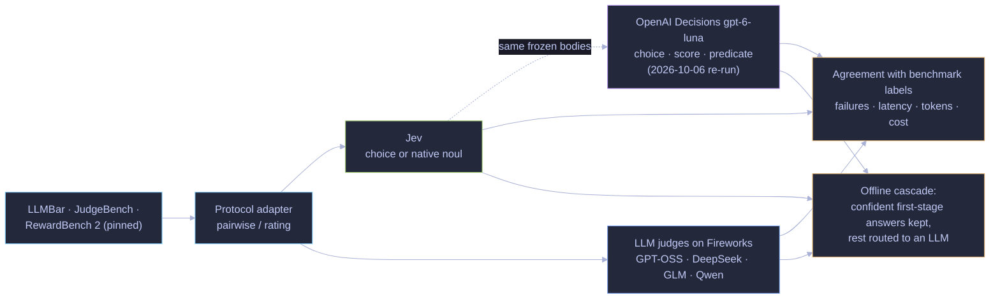
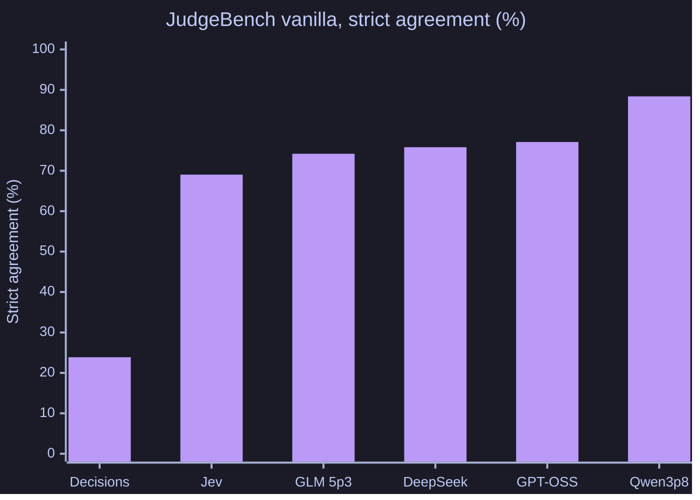

# Jev vs. LLM judges

Compare benchmark-label agreement, service failures, latency, tokens, estimated cost and selective routing on LLMBar, JudgeBench and RewardBench 2. Agreement with benchmark labels is not independently verified correctness. Native Jev interfaces and established LLM judging protocols are distinguished in the Go harness.

[Aggregate measurements](results/primary/) retain numerical quality, reliability, native-interface comparisons and rating sensitivity. Benchmark examples, submitted answers, frozen request receipts and full archives are not bundled. The private originals remain unchanged; numerical projections cannot substitute for receipt-level audit.

`go run ./cmd/evalevaluation --help` lists the CLI. `go run ./cmd/evalevaluation prepare` acquires pinned upstream sources into the local ignored cache with hash verification. Configs and runtime third-party adapters are included with their licenses. Provider-backed campaign commands incur costs; use a new output directory. The official-data replay integration test requires private historical fixtures and is skipped in this source-free distribution.

## How it works

Every judge sees the same examples through the same protocol adapter. The cascade is simulated offline from the recorded outputs, with thresholds chosen on development cases. The dotted branch is the [OpenAI Decisions re-run](#openai-decisions-re-run-2026-10-06), which sends the Jev arm's frozen request bodies to Decisions through the [adapter](../openai-decisions-adapter/README.md).

## Reproduce

See [shared setup and limits](../../REPRODUCTION.md). From this directory, build with `go build ./...`, run synthetic checks with `go test ./...`, and inspect CLI help before any paid run. Numerical reports are under `results/`. No historical evidence download is required or available in this distribution.

## Final service-retry comparison

| Judge | LLMBar Vanilla | JudgeBench vanilla | RewardBench 2 ratings |
|---|---:|---:|---:|
| Jev | 87.36% | 69.03% | 68.12% |
| GPT-OSS 120B | 87.05% | 77.10% | 79.56% |
| DeepSeek V4 Flash | 88.73% | 75.81% | 65.99% |
| GLM 5p3 | 91.18% | 74.19% | 27.59% |
| Qwen3p8 Max | 92.53% | 88.39% | 81.57% |

These final scores include the separately reported service-error retries, charging both passes. Required-stage failures score zero. LLMBar/RewardBench average subsets equally; JudgeBench pools cases. Compare within a column. [Retry results](results/primary-recovery-analysis-v1/service-recovery.json) are separate from the original-run metrics.

An offline Jev → GPT-OSS cascade on 513 held-out JudgeBench cases scored 80.12% versus 76.41% for GPT-OSS alone, with 43.69% lower accounting cost. The paired gain was 3.70 points (95% interval 1.17–6.43). This simulation uses original unrecovered outputs and development-selected thresholds; timing adds separately measured calls. Other pairings lost quality: the LLMBar → Qwen cascade lost 3.52 points. [All cascade measurements](results/cascade-evaluation-v1/cascades.json). Prices are dated list estimates, not invoices; intervals are unadjusted for multiple comparisons.

## OpenAI Decisions re-run (2026-10-06)

**What changed and what was held fixed.** Only the Jev arm was re-run. Its frozen typed requests for all 19 primary methods (11,255 jobs) and the native Compact and Atomic interfaces (838 jobs) were sent unchanged to OpenAI's [Decisions API](https://developers.openai.com/api/docs/guides/decisions) (`gpt-6-luna`, wire format `guide-2026-10-06`) through the [adapter](../openai-decisions-adapter/README.md). Pairwise questions became Decisions `choice` questions in the frozen option order, ratings became native `score` questions over the same levels (modal scoring as frozen), and Atomic Noul questions became predicates. The four LLM judges, the frozen Jev arm, the analysis plan and the GPT-OSS helper outputs used by six LLMBar methods are reused unchanged, so both decision models judged identical text.

**Final service-retry comparison, with Decisions.** Same columns and policy as the table above. Decisions needed no service-error pass, so its scores are the same under both policies.

| Judge | LLMBar Vanilla | JudgeBench vanilla | RewardBench 2 ratings |
|---|---:|---:|---:|
| **OpenAI Decisions** | **79.16%** | **23.87%** | **61.32%** |
| Jev | 87.36% | 69.03% | 68.12% |
| GPT-OSS 120B | 87.05% | 77.10% | 79.56% |
| DeepSeek V4 Flash | 88.73% | 75.81% | 65.99% |
| GLM 5p3 | 91.18% | 74.19% | 27.59% |
| Qwen3p8 Max | 92.53% | 88.39% | 81.57% |

**All 19 methods (original policy).** On LLMBar, Decisions scored 67.72% (Vanilla_1shot) to 87.46% (Rating_Metrics_Reference). It beat the frozen Jev arm on all five LLMBar rating methods (Rating, Rating_Metrics, Rating_Metrics_Reference, Rating_NoRules and Rating_Reference: +1.2 to +5.1 points; three intervals exclude zero, for example Rating_Metrics_Reference +5.05 [+2.28, +8.03]), and lost on every pairwise method (−4.3 to −14.0 points, all intervals below zero). On RewardBench 2 it was 6.4 (fourway) and 5.4 (ratings) points below Jev; on JudgeBench arena_hard, 40.81% vs. 65.97%. Native interfaces: Compact 77.86% vs. Jev 87.43% (−9.56 [−12.72, −6.47]); Atomic 76.72% vs. 81.47% (−4.75 [−7.60, −1.85]). Intervals are paired, 2,000-replicate bootstrap, unadjusted for 21 comparisons.

**Why JudgeBench collapsed: first-position bias.** Each pair is judged in both presentation orders. Decisions picked whichever response was shown first, in both orders, on 441 of 620 JudgeBench vanilla pairs (71.1%) and never picked the second-shown response in both orders. Jev did the first on 40 pairs (6.5%) and the second on 35.

| Pairs where the judge picked the same *position* in both orders | Decisions: first shown | Decisions: second shown | Jev: first shown | Jev: second shown |
|---|---:|---:|---:|---:|
| JudgeBench vanilla (620 pairs) | 441 (71.1%) | 0 | 40 (6.5%) | 35 |
| JudgeBench arena_hard (620) | 206 (33.2%) | 25 | 33 (5.3%) | 36 |
| LLMBar Vanilla (419) | 102 (24.3%) | 0 | 27 (6.4%) | 7 |

Picking the same position in both orders means the two verdicts contradict each other, so at most one of them can agree with the label. JudgeBench pairs are long, hard responses to reasoning, math and code questions, where this bias dominated. The four LLM judges picked the first-shown response in both orders on 0.8% to 4.7% of JudgeBench vanilla pairs.

**Calibration.** On the two binary choice methods, Decisions' first-order probabilities were less calibrated than Jev's: JudgeBench vanilla Brier 0.282 / ECE 0.257 (Jev 0.164 / 0.088); LLMBar Vanilla 0.157 / 0.153 (Jev 0.089 / 0.046).

**Decisions-first cascades.** The four preregistered cascades were re-selected with Decisions as the first stage (thresholds on the development fold only) and evaluated once on held-out cases. None improved on the fallback alone: JudgeBench → GPT-OSS 76.02% vs. 76.41% (−0.39 [−2.34, +1.56]) at 0.99× the cost, where the frozen Jev-first cascade gained 3.70 points at 43.69% lower cost; JudgeBench → Qwen −2.73 [−4.29, −1.17]; LLMBar → GPT-OSS −1.07 [−3.36, +1.02] at 0.72× the cost; LLMBar → Qwen −0.77 [−1.94, 0.00] at 0.70× the cost.

**Refusals and service failures.** Decisions refused **159 requests, all on RewardBench 2**: 23 fourway requests (23 invalid jobs) and 136 rating requests (70 invalid jobs). Refusals are never retried or given a value, so a refused required stage scores zero, like a service failure. There were no refusals on LLMBar, JudgeBench or the native interfaces. Service errors were negligible: 5 transient attempts (four HTTP 503, one 504) in about 30,000 requests, all recovered by the in-run retry, so no job needed the service-error pass (the frozen Jev arm sent 207 jobs to it).

**Cost and latency.** The Decisions arm billed 28.4M input tokens, **$2.84** at $0.10 per million (output is not billed); the accounting total of $3.41 adds the reused GPT-OSS helper calls ($0.63) at their frozen prices. The comparable frozen Jev accounting was $2.21 including the same helpers. Median request time was 0.12 s for both Decisions and Jev; Decisions' median job time (3.2 s vs. Jev's 0.27 s) reflects client-side pacing of the re-run, not model latency.

**Verification (2026-10-08).** Because the JudgeBench score is so low, the pipeline was checked against the live API on a seeded sample of 100 JudgeBench vanilla pairs in both orders (about $0.15 of requests):

| Check | Result |
|---|---|
| Replay of the frozen requests | 200/200 identical answers: the run recorded what the API returns, and Decisions is deterministic |
| Truncation | Ruled out: no request exceeds about 4k tokens, and first-shown picks are most frequent on the shortest inputs (73% under 1k tokens) |
| 20 blatantly easy pairs in the same template and format, both orders | 40/40 correct, no first-shown picks, confidence ≈ 1.0, so both outputs are read and the A/B mapping is right |
| Input as a readable transcript instead of the frozen JSON state | first-shown in both orders 70% → 64%; strict agreement 27% → 29% |
| Input as native Decisions messages | 62%; 32% |
| Readable input plus a self-contained question (protocol deviation, diagnostic only) | 52%; 38% |

The bias is the model's behavior on hard pairs, not a harness error. The frozen Jev-style framing costs Decisions a few points, far short of Jev's 69.03%. Of the 93 invalid RewardBench 2 jobs, 92 are in the Safety subset (refused harmful prompts), none in Math, Factuality or Precise IF.

**Caveats.** Agreement with benchmark labels is not verified correctness. Prompts and protocols were designed for Jev and frozen; Decisions was not given a position-debiased or tuned prompt. The two arms ran on different days through different services. [Source-free aggregates](results/openai-decisions-v1/README.md) include per-method scores, deltas, reliability, position-bias counts and cascades.
