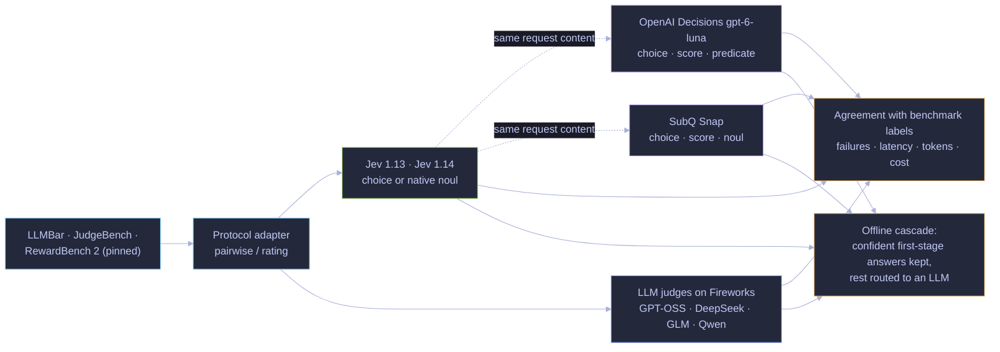
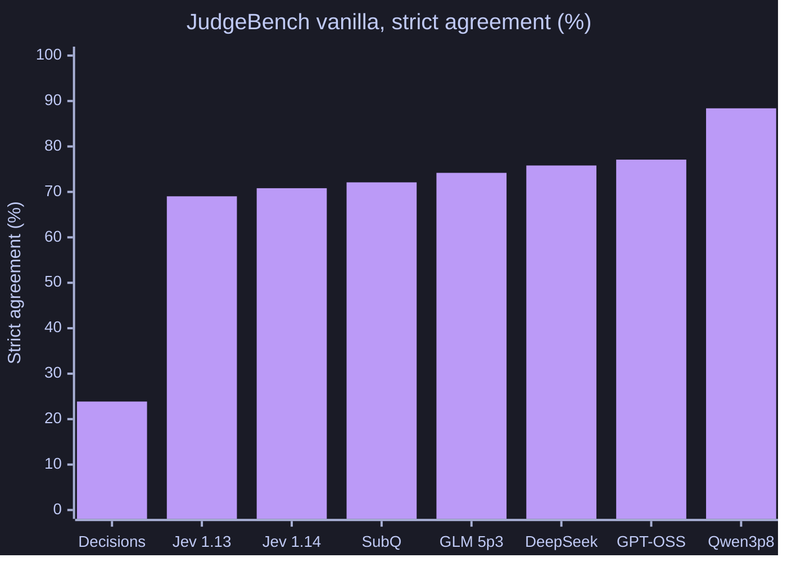

# Decision models vs. LLM judges

Compare Jev 1.13, Jev 1.14, OpenAI Decisions, SubQ Snap and four LLM judges on benchmark-label agreement, service failures, latency, tokens, estimated cost and selective routing across LLMBar, JudgeBench and RewardBench 2. Agreement with benchmark labels is not independently verified correctness. Native decision-model interfaces and established LLM judging protocols are distinguished in the Go harness.

## TL;DR

[Rune](https://fireworks.ai/models/fireworks/rune) scored 84.94% on LLMBar Vanilla, 65.97% on JudgeBench vanilla and 65.89% on RewardBench 2 ratings, completing all 11,255 primary jobs. Against Jev 1.13 with failed service jobs recovered, the gaps were −2.4, −3.1 and −2.2 points; their paired 95% intervals include zero. Rune was significantly worse on RewardBench four-way (−6.9 pp [−9.4, −4.3]) and JudgeBench arena-hard (−4.7 pp [−8.4, −1.3]), while four LLMBar rating methods favored Rune.

No judge dominated every benchmark. Qwen3p8 Max led the three headline LLMBar, JudgeBench, and RewardBench 2 methods at 92.53%, 88.39%, and 81.57% strict agreement. Among decision models, SubQ and Jev 1.14 were strongest: SubQ scored 88.06%, 72.10%, and 69.39%, and Jev 1.14 scored 88.24%, 70.81%, and 69.14%, both above Jev 1.13's 87.36%, 69.03%, and 68.12%. Jev 1.14's point estimate exceeded Jev 1.13 on all 19 primary methods, SubQ's on 18 of 19. Decisions was competitive on some LLMBar rating prompts but fell to 23.87% on JudgeBench vanilla because it selected the first-shown response in both presentation orders for 71.1% of pairs. SubQ showed a much smaller 9.2% version of that bias and Jev 1.14 2.9%; both completed every job without refusal or invalid answer, while Decisions refused 159 RewardBench requests. A held-out Jev 1.13-first JudgeBench cascade improved GPT-OSS from 76.41% to 80.12% while reducing accounting cost by 43.69%; other cascades were weaker or inconclusive. Scores measure benchmark-label agreement, not independently verified correctness, and reported intervals are not multiplicity-adjusted.

[Aggregate measurements](results/primary/) retain numerical quality, reliability, native-interface comparisons and rating sensitivity. Benchmark examples, submitted answers, frozen request receipts and full archives are not bundled. The private originals remain unchanged; numerical projections cannot substitute for receipt-level audit.

`go run ./cmd/evalevaluation --help` lists the CLI. `go run ./cmd/evalevaluation prepare` acquires pinned upstream sources into the local ignored cache with hash verification. Configs and runtime third-party adapters are included with their licenses. Provider-backed campaign commands incur costs; use a new output directory. The official-data replay integration test requires private receipt fixtures and is skipped in this source-free distribution.

## How it works

```mermaid
%%{init: {"theme": "base", "themeVariables": {"background": "#1a1b26", "primaryColor": "#24283b", "primaryTextColor": "#c0caf5", "textColor": "#c0caf5", "primaryBorderColor": "#7aa2f7", "lineColor": "#a9b1d6", "edgeLabelBackground": "#1a1b26"}}}%%
flowchart LR
    D["LLMBar · JudgeBench ·<br/>RewardBench 2 (pinned)"] --> P["Protocol adapter<br/>pairwise / rating"]
    P --> J["Jev 1.13 · Jev 1.14<br/>choice or native noul"]
    P --> L["LLM judges on Fireworks<br/>GPT-OSS · DeepSeek · GLM · Qwen"]
    J -. "same request content" .-> O["OpenAI Decisions gpt-6-luna<br/>choice · score · predicate"]
    J -. "same request content" .-> S["SubQ Snap<br/>choice · score · noul"]
    J --> M["Agreement with benchmark labels<br/>failures · latency · tokens · cost"]
    L --> M
    O --> M
    S --> M
    J --> R["Offline cascade:<br/>confident first-stage answers kept,<br/>rest routed to an LLM"]
    O --> R
    S --> R
    L --> R
    classDef shared fill:#24283b,stroke:#7dcfff,color:#c0caf5;
    classDef baseline fill:#24283b,stroke:#7aa2f7,color:#c0caf5;
    classDef jev fill:#24283b,stroke:#9ece6a,color:#c0caf5;
    classDef decisions fill:#24283b,stroke:#bb9af7,color:#c0caf5;
    classDef score fill:#24283b,stroke:#e0af68,color:#c0caf5;
    class D,P shared;
    class L baseline;
    class J jev;
    class O,S decisions;
    class M,R score;
```

Every judge sees the same examples through the same protocol adapter. The cascade is simulated offline from the recorded outputs, with thresholds chosen on development cases. The [OpenAI adapter](../openai-decisions-adapter/README.md) maps pairwise questions to `choice`, ratings to `score`, and Atomic Noul questions to predicates without changing the judged text. The [SubQ adapter](../subq-adapter/README.md) sends the shared Jev-compatible content directly.

## Reproduce

See [shared setup and limits](../../REPRODUCTION.md). From this directory, build with `go build ./...`, run synthetic checks with `go test ./...`, and inspect CLI help before any paid run. Numerical reports are under `results/`. No original receipt archive is required or available in this distribution.

Rune uses the [Fireworks client](../fireworks-systemone-adapter/README.md) with the same planned Jev requests, changing only `model`. Strict agreement counts required-stage failures as wrong; model-judge agreement is distinct from independent correctness. [Rune primary/native aggregates](results/rune-v1/summary.json) include usage, latency and paired first-pass contrasts. Those paired JSON contrasts use Jev’s original pass; the headline comparison uses Jev’s service-error recovery policy. Rune needed no service-error recovery. Costs are input tokens × the dated $0.042/M rate; helper LLM costs are separate, and round trips are deployment observations.

## Provider comparison

The 19 primary methods contain 11,255 jobs, and the native Compact and Atomic interfaces contain 838. Samples, typed question content, option order, analysis plan, and GPT-OSS helper outputs are shared across decision-model providers. Jev is evaluated in two versions, Jev 1.13 (`jev-1.13.0`) and Jev 1.14 (`jev-1.14.0`), with byte-identical request bodies apart from the model field (except Swap and Swap_CoT synthesis stages, which embed each judge's own earlier answers).

| Judge | LLMBar Vanilla | JudgeBench vanilla | RewardBench 2 ratings |
|---|---:|---:|---:|
| **OpenAI Decisions** | **79.16%** | **23.87%** | **61.32%** |
| **SubQ Snap** | **88.06%** | **72.10%** | **69.39%** |
| Jev 1.13 | 87.36% | 69.03% | 68.12% |
| Jev 1.14 | 88.24% | 70.81% | 69.14% |
| Rune | 84.94% | 65.97% | 65.89% |
| GPT-OSS 120B | 87.05% | 77.10% | 79.56% |
| DeepSeek V4 Flash | 88.73% | 75.81% | 65.99% |
| GLM 5p3 | 91.18% | 74.19% | 27.59% |
| Qwen3p8 Max | 92.53% | 88.39% | 81.57% |

These scores apply the same service-retry policy and charge every attempt. Required-stage failures score zero. Decisions, SubQ and Jev 1.14 needed no separate service-error recovery pass. LLMBar/RewardBench average subsets equally; JudgeBench pools cases. Compare within a column. [Retry results](results/primary-recovery-analysis-v1/service-recovery.json) are reported separately from the primary metrics.

An offline Jev 1.13 → GPT-OSS cascade on 513 held-out JudgeBench cases scored 80.12% versus 76.41% for GPT-OSS alone, with 43.69% lower accounting cost. The paired gain was 3.70 points (95% interval 1.17–6.43). This simulation uses original unrecovered outputs and development-selected thresholds; timing adds separately measured calls. Other pairings lost quality: the Jev 1.13 LLMBar → Qwen cascade lost 3.52 points. [All cascade measurements](results/cascade-evaluation-v1/cascades.json). Prices are dated list estimates, not invoices; intervals are unadjusted for multiple comparisons.

```mermaid
%%{init: {"theme": "base", "themeVariables": {"background": "#1a1b26", "xyChart": {"backgroundColor": "#1a1b26", "titleColor": "#c0caf5", "xAxisLabelColor": "#c0caf5", "xAxisTitleColor": "#c0caf5", "xAxisLineColor": "#a9b1d6", "xAxisTickColor": "#a9b1d6", "yAxisLabelColor": "#c0caf5", "yAxisTitleColor": "#c0caf5", "yAxisLineColor": "#a9b1d6", "yAxisTickColor": "#a9b1d6", "plotColorPalette": "#bb9af7"}}}}%%
xychart-beta
    title "JudgeBench vanilla, strict agreement (%)"
    x-axis ["Decisions", "Jev 1.13", "Jev 1.14", "SubQ", "GLM 5p3", "DeepSeek", "GPT-OSS", "Qwen3p8"]
    y-axis "Strict agreement (%)" 0 --> 100
    bar [23.87, 69.03, 70.81, 72.10, 74.19, 75.81, 77.10, 88.39]
```

**SubQ across all methods.** SubQ's primary strict scores ranged from 68.23% on JudgeBench arena_hard to 89.76% on LLMBar Vanilla_2shot. Its point estimate exceeded Jev 1.13 on 18 of 19 methods; ten paired 95% intervals excluded zero, including JudgeBench vanilla +4.35 points [+1.13, +7.58], LLMBar Vanilla_1shot +6.37 [+3.49, +9.34], and RewardBench 2 ratings +2.70 [+0.35, +5.12]. Native Compact scored 89.10% vs. Jev 1.13 87.43% (+1.67 [−1.00, +4.39]); Atomic scored 85.72% vs. 81.47% (+4.26 [+1.54, +7.16]). Intervals are paired, 2,000-replicate bootstrap and unadjusted for 21 comparisons.

**Jev 1.14 across all methods.** Jev 1.14's primary strict scores ranged from 69.14% on RewardBench 2 ratings to 89.44% on LLMBar Metrics_Reference, with all 11,255 primary and 838 native jobs valid. Its point estimate exceeded Jev 1.13 on all 19 primary methods. Under the service-retry policy, which recovers Jev 1.13's 207 service-failed jobs, the paired gain was +0.20 to +3.55 points and five 95% intervals excluded zero: JudgeBench arena_hard +3.55 [+0.97, +5.97], LLMBar Swap +2.52 [+0.52, +4.50], Reference +1.93 [+0.35, +3.57], Swap_CoT +1.82 [+0.00, +3.79] and Metrics_Reference +1.30 [+0.12, +2.49]. Scoring each version's first pass with failures as zero, the gain was +2.13 to +5.00 and all 19 intervals excluded zero, partly because Jev 1.13 had failures and Jev 1.14 had none. Restricting to cases both versions answered gave +0.30 to +3.79 with four intervals excluding zero. The native interface showed no measurable difference: Compact 87.01% vs. Jev 1.13 87.43% (−0.42 [−1.92, +1.08]); Atomic 81.83% vs. 81.47% (+0.37 [−1.05, +1.79]). Against the LLM judges, Jev 1.14 trailed GPT-OSS by 6.29 points on JudgeBench vanilla [−10.32, −2.25], 5.65 on arena_hard, 6.76 on RewardBench 2 fourway and 10.42 on ratings [−12.85, −8.01], where Jev 1.13 trailed by 9.4, 10.6, 9.1 and 12.9. On LLMBar it was level with GPT-OSS: ahead on Metrics_Reference (+4.77 [+2.13, +7.66]) and Rating_Metrics_Reference (+4.57 [+1.37, +7.75]), behind on Rating_NoRules (−3.52 [−6.85, −0.25]), and within noise on the other 12 methods. Its point estimate was below Qwen3p8 Max on all 19. LLMBar swap consistency (same verdict in both orders) was higher than Jev 1.13's on 12 of 15 methods, by 3.3 to 5.7 points on the five rating methods. These comparisons use the original policy except where stated; intervals are paired, 2,000-replicate bootstrap and unadjusted.

**All 19 methods.** On LLMBar, Decisions scored 67.72% (Vanilla_1shot) to 87.46% (Rating_Metrics_Reference). It beat Jev 1.13 on all five LLMBar rating methods (Rating, Rating_Metrics, Rating_Metrics_Reference, Rating_NoRules and Rating_Reference: +1.2 to +5.1 points; three intervals exclude zero, for example Rating_Metrics_Reference +5.05 [+2.28, +8.03]), and lost on every pairwise method (−4.3 to −14.0 points, all intervals below zero). On RewardBench 2 it was 6.4 (fourway) and 5.4 (ratings) points below Jev 1.13; on JudgeBench arena_hard, 40.81% vs. 65.97%. Native interfaces: Compact 77.86% vs. Jev 1.13 87.43% (−9.56 [−12.72, −6.47]); Atomic 76.72% vs. 81.47% (−4.75 [−7.60, −1.85]). Intervals are paired, 2,000-replicate bootstrap, unadjusted for 21 comparisons.

**Why JudgeBench collapsed: first-position bias.** Each pair is judged in both presentation orders. Decisions picked whichever response was shown first, in both orders, on 441 of 620 JudgeBench vanilla pairs (71.1%) and never picked the second-shown response in both orders. Jev 1.13 did the first on 40 pairs (6.5%) and the second on 35; Jev 1.14 did the first on 18 (2.9%) and the second on 59.

| Pairs where the judge picked the same *position* in both orders | Decisions: first shown | Decisions: second shown | Jev 1.13: first shown | Jev 1.13: second shown | Jev 1.14: first shown | Jev 1.14: second shown |
|---|---:|---:|---:|---:|---:|---:|
| JudgeBench vanilla (620 pairs) | 441 (71.1%) | 0 | 40 (6.5%) | 35 | 18 (2.9%) | 59 |
| JudgeBench arena_hard (620) | 206 (33.2%) | 25 | 33 (5.3%) | 36 | 26 (4.2%) | 35 |
| LLMBar Vanilla (419) | 102 (24.3%) | 0 | 27 (6.4%) | 7 | 19 (4.5%) | 6 |

Picking the same position in both orders means the two verdicts contradict each other, so at most one of them can agree with the label. JudgeBench pairs are long, hard responses to reasoning, math and code questions, where this bias dominated. The four LLM judges picked the first-shown response in both orders on 0.8% to 4.7% of JudgeBench vanilla pairs.

SubQ picked the first-shown response in both orders on 57/620 JudgeBench vanilla pairs (9.2%), the second-shown response on 12, and made an order-consistent choice on 551. Its corresponding counts were 42/38/537 on JudgeBench arena_hard and 12/3/404 on LLMBar Vanilla. The order effect is measurable but far smaller than Decisions' JudgeBench collapse.

Jev 1.14 made an order-consistent choice on 543/620 JudgeBench vanilla pairs, 531/620 arena_hard pairs and 394/419 LLMBar Vanilla pairs (Jev 1.13: 536, 506 and 378, with 9, 13 and 7 pairs incomplete because of service failures). On JudgeBench vanilla its remaining position preference leaned toward the second-shown response.

**Calibration.** On the two binary choice methods, Decisions' first-order probabilities were less calibrated than Jev 1.13's: JudgeBench vanilla Brier 0.282 / ECE 0.257 (Jev 1.13 0.164 / 0.088); LLMBar Vanilla 0.157 / 0.153 (Jev 1.13 0.089 / 0.046).

SubQ's first-order probabilities were similarly calibrated to Jev 1.13: JudgeBench vanilla Brier 0.157 / ECE 0.066 and LLMBar Vanilla 0.083 / 0.047. Jev 1.14's were slightly better calibrated than Jev 1.13's: JudgeBench vanilla 0.163 / 0.065 and LLMBar Vanilla 0.082 / 0.035, with 100% coverage on both.

**Jev-first cascades.** The four preregistered cascades were run with each Jev version as the first stage, thresholds selected on that version's development fold and evaluated once on held-out cases:

| Benchmark → fallback (held-out cases) | First stage | Threshold | Accepted | Cascade | Fallback alone | Paired gain, points [95% CI] | Accounting cost vs. fallback |
|---|---|---:|---:|---:|---:|---:|---:|
| JudgeBench → GPT-OSS (513) | Jev 1.13 | 0.69 | 63.16% | 80.12% | 76.41% | +3.70 [+1.17, +6.43] | 0.56× |
| | Jev 1.14 | 0.50 | 88.69% | 78.56% | 76.41% | +2.14 [−1.75, +5.85] | 0.23× |
| JudgeBench → Qwen (513) | Jev 1.13 | 0.83 | 44.05% | 86.94% | 87.72% | −0.78 [−2.73, +1.17] | 0.66× |
| | Jev 1.14 | 0.88 | 30.02% | 87.91% | 87.72% | +0.19 [−0.97, +1.36] | 0.83× |
| LLMBar → GPT-OSS (325) | Jev 1.13 | 0.51 | 91.08% | 88.50% | 87.38% | +1.12 [−1.30, +3.81] | 0.36× |
| | Jev 1.14 | 0.51 | 93.85% | 89.68% | 87.38% | +2.29 [−0.60, +5.44] | 0.31× |
| LLMBar → Qwen (325) | Jev 1.13 | 0.51 | 91.08% | 89.33% | 92.85% | −3.52 [−6.19, −1.08] | 0.12× |
| | Jev 1.14 | 0.67 | 84.31% | 91.22% | 92.85% | −1.64 [−3.43, +0.02] | 0.22× |

With Jev 1.14 first, LLMBar cascades scored higher than with Jev 1.13 first at either fallback, and the LLMBar → Qwen loss was no longer distinguishable from zero. On JudgeBench → GPT-OSS, Jev 1.14's development fold chose a lower threshold, which accepted more cases and cut cost further but gave a smaller gain whose interval includes zero. Excluding the 24 held-out JudgeBench cases whose exact question appears in development, Jev 1.14 → GPT-OSS gained +1.43 [−2.66, +5.32] at 0.23× cost.

**Decisions-first cascades.** The four preregistered cascades use Decisions as the first stage, with thresholds selected on the development fold and evaluated once on held-out cases. None improved on the fallback alone: JudgeBench → GPT-OSS 76.02% vs. 76.41% (−0.39 [−2.34, +1.56]) at 0.99× the cost, where the Jev 1.13-first cascade gained 3.70 points at 43.69% lower cost; JudgeBench → Qwen −2.73 [−4.29, −1.17]; LLMBar → GPT-OSS −1.07 [−3.36, +1.02] at 0.72× the cost; LLMBar → Qwen −0.77 [−1.94, 0.00] at 0.70× the cost.

**SubQ-first cascades.** JudgeBench → GPT-OSS accepted 87.5% at the first stage, scored 78.56% vs. 76.41% for GPT-OSS alone (+2.14 [−1.75, +5.85]), and cost 0.26× as much under accounting that includes shared helpers. LLMBar → GPT-OSS scored 88.86% vs. 87.38% (+1.48 [−1.52, +4.69]) at 0.26× cost. Neither interval excludes zero. The Qwen fallbacks lost 1.17 and 2.93 points respectively, with intervals touching zero.

**Refusals and service failures.** Decisions refused **159 requests, all on RewardBench 2**: 23 fourway requests (23 invalid jobs) and 136 rating requests (70 invalid jobs). Refusals are never retried or given a value, so a refused required stage scores zero, like a service failure. There were no refusals on LLMBar, JudgeBench or the native interfaces. Service errors were negligible: 5 transient attempts (four HTTP 503, one 504) in about 30,000 requests, all recovered by the in-run retry, so no Decisions job needed the service-error pass; the Jev 1.13 arm sent 207 jobs to it, after 423 primary requests ended in HTTP 503, 529 or timeout failures.

SubQ completed 29,487 requests with no refusal, invalid job, retry, HTTP error or service-recovery job. Jev 1.14 completed 29,519 requests with no refusal, invalid job, HTTP 429 or service-recovery job; its single error attempt, one transient HTTP 502, succeeded on the in-run retry.

**Cost and latency.** The Decisions arm billed 28.4M input tokens, **$2.84** at $0.10 per million (output is not billed); the accounting total of $3.41 adds the shared GPT-OSS helper calls ($0.63) at their recorded prices. Jev 1.13 accounting was $2.21 including the same helpers. Median request time was 0.12 s for both Decisions and Jev 1.13; Decisions' median job time (3.2 s vs. Jev 1.13's 0.27 s) reflects client-side pacing, not model latency.

Jev 1.14 billed 32.79M input tokens, an estimated **$1.38** at $0.042 per million (output is not billed); its $2.01 accounting total includes the same GPT-OSS helpers. Median round trips were 0.071 s for primary requests (p95 0.087 s) and 0.068 s for native-interface requests, against 0.119 s and 0.110 s for Jev 1.13; the two versions ran at different concurrency and service load.

SubQ billed 26.65M input tokens, an estimated **$1.33** at $0.05 per million; its $1.96 accounting total includes the reused GPT-OSS helpers. Median round trips were 0.175 s for primary requests and 0.222 s for native-interface requests. Provider routes and loads differ, so cross-provider latency is descriptive.

**Verification.** Because the JudgeBench score is so low, the pipeline was checked against the live API on a seeded sample of 100 JudgeBench vanilla pairs in both orders (about $0.15 of requests):

| Check | Result |
|---|---|
| Replay of the frozen requests | 200/200 identical answers: the run recorded what the API returns, and Decisions is deterministic |
| Truncation | Ruled out: no request exceeds about 4k tokens, and first-shown picks are most frequent on the shortest inputs (73% under 1k tokens) |
| 20 blatantly easy pairs in the same template and format, both orders | 40/40 correct, no first-shown picks, confidence ≈ 1.0, so both outputs are read and the A/B mapping is right |
| Input as a readable transcript instead of the frozen JSON state | first-shown in both orders 70% → 64%; strict agreement 27% → 29% |
| Input as native Decisions messages | 62%; 32% |
| Readable input plus a self-contained question (protocol deviation, diagnostic only) | 52%; 38% |

The bias is the model's behavior on hard pairs, not a harness error. The shared Jev-style framing costs Decisions a few points, far short of Jev 1.13's 69.03%. Of the 93 invalid RewardBench 2 jobs, 92 are in the Safety subset (refused harmful prompts), none in Math, Factuality or Precise IF.

**Caveats.** Agreement with benchmark labels is not verified correctness. Prompts and protocols were designed for Jev and fixed before evaluation; Decisions and SubQ were not given position-debiased or provider-tuned prompts. Provider measurements used different services and service conditions, so latency comparisons, including between the two Jev versions, are descriptive. Each request was sent once; Jev 1.14 is not exactly deterministic (repeating a request moved its probabilities by about 0.01), and run-to-run variance on the full benchmarks was not measured. Source-free aggregates for [Decisions](results/openai-decisions-v1/README.md), [SubQ](results/subq-v1/README.md) and [Jev 1.14](results/jev-1.14.0-v1/README.md) include per-method scores, deltas, reliability, position-bias counts and cascades.
