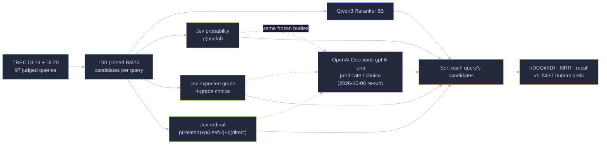
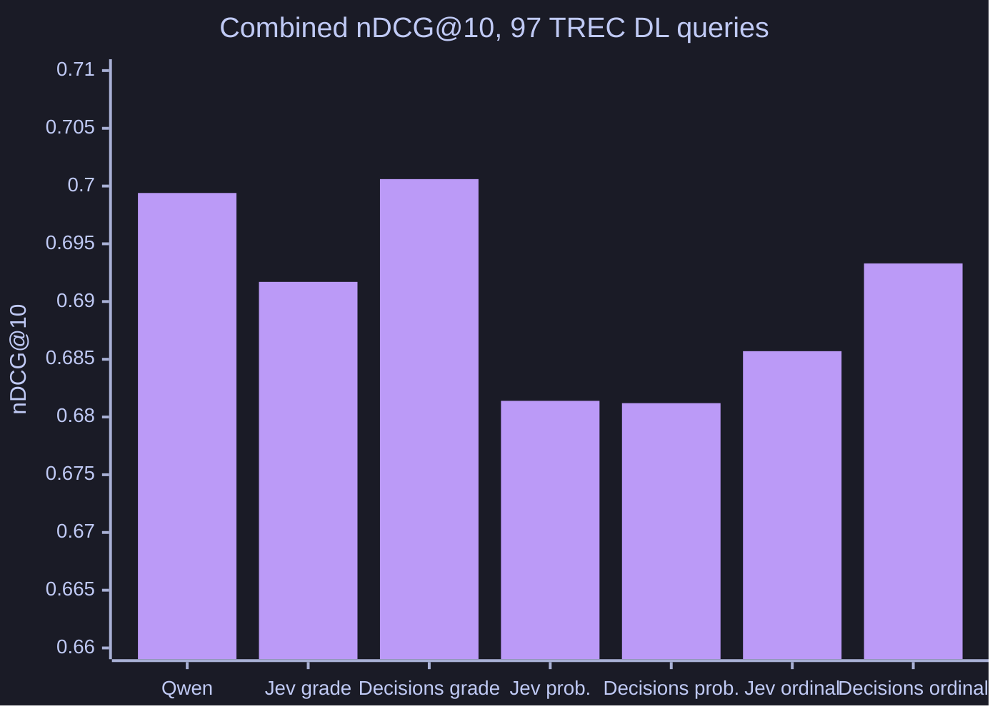

# Jev vs. rerankers

Compare Qwen3 Reranker 8B and Jev probability, expected-grade and ordinal scores over the same 100 BM25 candidate passages for all 97 TREC DL 2019/2020 judged queries. Human qrels determine nDCG@10, MRR and recall; no answer-model judge is involved.

The nine-prompt exploratory follow-up found combined nDCG@10 of 0.6994 for Qwen, 0.6962 for explicit ordinal criteria and 0.6927 for the Noul utility statement. This small, reused sample does not establish equivalence. Aggregate JSON retains cost, timing, coverage and ranking metrics; source-bearing candidate text and receipts are omitted.

After dependency bootstrap, `go run . prepare` downloads upstream data without inference. `go run . run --study prompts --out results/new-prompts --max-cost 20` performs paid inference. `report` and `audit` operate on your own locally generated receipts. Whole-query timing depends on batching and concurrency.

## How it works

BM25 order is the control and a label-based oracle measures the candidate-set ceiling. No answer model or LLM judge is involved. The dotted branch is the [OpenAI Decisions re-run](#openai-decisions-re-run-2026-10-06): each Jev request body is sent unchanged to Decisions through the [adapter](../openai-decisions-adapter/README.md).

## OpenAI Decisions re-run (2026-10-06)

**What changed and what was held fixed.** Every Jev request body from both studies (the three main arms and the nine-prompt study) was sent unchanged to OpenAI's [Decisions API](https://developers.openai.com/api/docs/guides/decisions) (`gpt-6-luna`, wire format `guide-2026-10-06`) through the [adapter](../openai-decisions-adapter/README.md): Noul questions became predicates, and the four-grade question became a choice whose per-option probabilities feed the frozen expected-grade rule. Queries, candidates, qrels, prompts, tie handling, retries, metrics and the bootstrap are unchanged. Qwen, BM25 and all Jev rows are the frozen 2026-09-18 results, not re-run.

| Method | Combined nDCG@10 | DL19 | DL20 | MRR@10 | List cost (97 queries) |
|---|---:|---:|---:|---:|---:|
| Qwen3 Reranker 8B (frozen) | 0.6994 | 0.7343 | 0.6716 | 0.8593 | $0.325 |
| Jev expected grade (frozen) | 0.6917 | 0.7026 | 0.6831 | 0.8604 | $0.224 |
| **Decisions expected grade** | **0.7006** | 0.7088 | 0.6941 | 0.8561 | $0.318 |
| Jev probability (frozen) | 0.6814 | 0.6932 | 0.6721 | 0.8593 | $0.178 |
| Decisions probability | 0.6812 | 0.6844 | 0.6786 | 0.8595 | $0.306 |
| Jev ordinal (frozen) | 0.6857 | 0.7004 | 0.6740 | 0.8606 | $0.215 |
| Decisions ordinal | 0.6933 | 0.7111 | 0.6791 | 0.8562 | $0.658 |
| BM25 order | 0.4912 | 0.5058 | 0.4796 | 0.6751 | – |

Paired differences (95% bootstrap over queries, stratified by year, individually unadjusted):

- Decisions expected grade minus Qwen: **+0.0012 [−0.0207, +0.0226]**; minus frozen Jev expected grade: +0.0089 [−0.0082, +0.0280].
- Decisions probability minus Jev probability: −0.0002 [−0.0226, +0.0225]. Decisions ordinal minus Jev ordinal: +0.0076 [−0.0107, +0.0269].

**Prompt study.** All nine exploratory prompt variants were also re-run. Decisions scores ranged from 0.6563 to 0.6999 (Jev 0.6804 to 0.6962). Prompts did not transfer one for one: Decisions was better than Jev on the short grade (+0.0131) and short ordinal (+0.0162) prompts, and worse on the Noul utility statement (−0.0215 [−0.0449, +0.0024]) and the ordinal statement prompt (−0.0332 [−0.0595, −0.0056], the only interval excluding zero). Every prompt was written for Jev; none was tuned for Decisions.

**Refusals.** Decisions refused the `related` predicate of the ordinal-statement prompt on 23 passages, spread over 13 queries. Under the frozen policy a refusal is never retried or given a value, and those 13 query jobs fell back to BM25 order. There were no refusals in the other eleven Decisions arms. Excluding the 13 affected queries (84 remain), ordinal-statement scores 0.6725 on Decisions vs. 0.6844 on Jev (−0.0119 [−0.0358, +0.0129]) and 0.6964 for Qwen: the fallback explains about two-thirds of that prompt's gap to Jev, not all of it.

**Cost and latency.** The twelve Decisions arms made 116,418 requests (18 transient failed attempts, all retried successfully) for **$5.30** at $0.10 per million input tokens. Per request Decisions billed fewer input tokens than Jev on one-question prompts (about 316 vs. 438) but about 140 more per extra question, and its list price is 2.4× Jev's, so a Decisions arm cost 1.35× to 3.1× the same Jev arm. The median request took **0.12 s** (p95 about 0.4 s). Query wall time (median 2.3 s for 100 passages) is set by the client's 3,000 requests-per-minute pacing, not by the model, so it cannot be compared with the historical Jev (1.2 s) or Qwen (0.48 s) timings.

**Caveats.** 97 public queries that may overlap model training; intervals are individual, not familywise, and no equivalence is claimed; picking the best Decisions prompt after seeing results is not held-out validation; Decisions probabilities are rounded to 0.01, and ties are broken by BM25 order as for Jev. Source-free numbers, including the refusal sensitivity, are in [`results/openai-decisions-v1/`](results/openai-decisions-v1/README.md).

## Reproduce

See [shared setup and limits](../../REPRODUCTION.md). From this directory, build with `go build ./...`, run synthetic checks with `go test ./...`, and inspect CLI help before any paid run. Numerical reports are under `results/`. No historical evidence download is required or available in this distribution.
