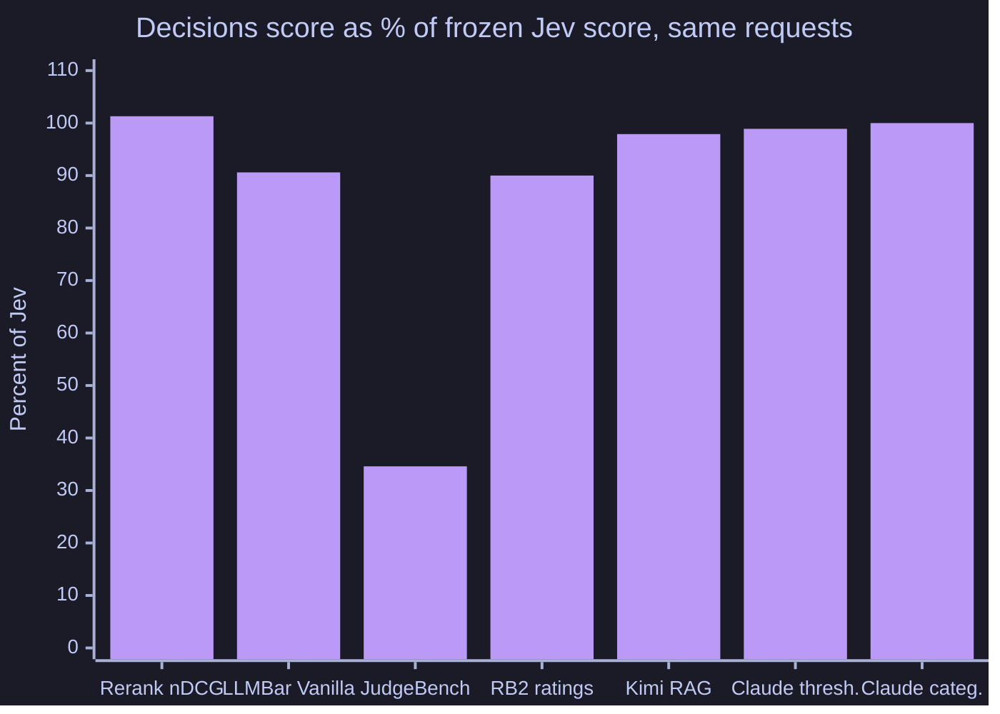

# OpenAI Decisions adapter for Jev requests

**Question:** if you send the exact requests these experiments sent to TypeSafe Jev to OpenAI's Decisions API instead, what changes?

This folder holds the small Go package that makes that possible. It is a provider-neutral translator, not an experiment by itself: every other experiment in this repository was re-run through it on 2026-10-06, and their READMEs report the results (summary [below](#results-across-experiments)).

## What OpenAI Decisions is

[Decisions](https://developers.openai.com/api/docs/guides/decisions) is an OpenAI API endpoint, `POST /v1/decisions`, in public beta (guide dated 2026-10-06). You send one text `input` and a list of typed questions; the model `gpt-6-luna` answers every question with calibrated probabilities instead of free text. There are three question types:

- **predicate**: is a condition true? Returns `probability`.
- **choice**: which of these named options? Returns `choice`, `confidence` and a probability for every option.
- **score**: where on an ordered scale of levels? Returns `score` (the probability-weighted level index), `confidence` and a probability per level.

A question may also come back as `{"type": "refusal"}`. The published price is **$0.10 per million input tokens**, with no output, cache-read or cache-write charges; the guide mentions regional-processing premiums and long-context multipliers without publishing thresholds, so they are not modeled here. Every cost in this repository is a list-price estimate from reported usage, not an invoice.

That is the same job Jev does: a fuzzy switch driven by natural-language questions about a state. It made a direct comparison possible.

## How a Jev request maps

| Jev request | Decisions request | Back to Jev's response shape |
|---|---|---|
| `state` (string or JSON) | `input`: strings verbatim, structured states as their exact JSON text | n/a |
| `noul` question | `predicate` with the same name and instructions; optional true/false criteria are appended to the instructions | `{"noul": probability}`; the API's own probability, nothing derived |
| `choice` question | `choice` with the criteria as option descriptions, in the body's order | `{choice, confidence, probabilities}` |
| `score` question (ordered levels) | `score` with the same levels in order | `{score, confidence, probabilities, legend}` |
| any answer the model declines | `refusal` | kept visible as `{"type": "refusal"}`; never retried, never given a value |

Question order follows the request body, so studies that vary question order keep it on the wire. Usage is passed through only when the API reports it, so a request with missing usage is never priced as free.

```mermaid
%%{init: {"theme": "base", "themeVariables": {"background": "#1a1b26", "primaryColor": "#24283b", "primaryTextColor": "#c0caf5", "textColor": "#c0caf5", "primaryBorderColor": "#7aa2f7", "lineColor": "#a9b1d6", "edgeLabelBackground": "#1a1b26"}}}%%
flowchart LR
    B["Frozen Jev body<br/>model · state · questions"] --> P["decisions.ParsePlan<br/>context + ordered questions"]
    P --> E["wire.go Encode<br/>noul → predicate<br/>choice → choice<br/>score → score"]
    E -->|"POST /v1/decisions"| O["OpenAI Decisions<br/>gpt-6-luna"]
    O --> D["wire.go Decode<br/>strict: one answer per question,<br/>allowed options, p in [0, 1]"]
    D --> N["JevResponse<br/>Jev-shaped answers<br/>refusals kept visible"]
    N --> X["Each experiment's unchanged<br/>parsers · replay · analysis"]
    classDef shared fill:#24283b,stroke:#7dcfff,color:#c0caf5;
    classDef jev fill:#24283b,stroke:#9ece6a,color:#c0caf5;
    classDef decisions fill:#24283b,stroke:#bb9af7,color:#c0caf5;
    classDef score fill:#24283b,stroke:#e0af68,color:#c0caf5;
    class B jev;
    class P,E,D,N shared;
    class O decisions;
    class X score;
```



Because every Decisions request is a translation of a byte-identical frozen Jev body, each Decisions answer pairs with the frozen Jev answer to the same request. The Jev results were not re-run; baselines (Qwen, the LLM judges, unfiltered RAG arms) were reused from frozen results.

## What is in this folder

- [`decisions/adapter.go`](decisions/adapter.go): provider-neutral parsing of a Jev body into a `Plan`, and conversion of answers back into Jev's response shape.
- [`decisions/wire.go`](decisions/wire.go): the only file that depends on the Decisions wire format (`WireVersion` `guide-2026-10-06`), plus a minimal HTTP client with no retry policy (each experiment keeps its own receipts, retries and budget).
- [`decisions/probe.go`](decisions/probe.go): a free access check that posts an empty body and classifies the answer.
- [`cmd/decisions-probe`](cmd/decisions-probe/main.go): runs the probe; `--smoke` sends one tiny paid three-question request (predicate, choice, score) and fails unless it normalizes.
- [`cmd/decisions-fake`](cmd/decisions-fake/main.go): a local server speaking the documented format with deterministic pseudo-random answers, for offline end-to-end checks. Its answers carry no signal; never report them.
- Unit tests covering translation, ordering, strict decoding, refusals, usage handling, endpoint routing and a round trip through an `httptest` server.

The module has no dependencies outside the Go standard library.

## Results across experiments

Same frozen requests, same samples, same scoring. Jev numbers are the frozen published ones; differences are within-experiment and use each experiment's own metric.

| Experiment | Metric | Baseline | Frozen Jev | Decisions | Decisions refusals |
|---|---|---:|---:|---:|---:|
| [Rerankers](../jev-vs-rerankers/README.md#openai-decisions-re-run-2026-10-06) (expected grade) | nDCG@10, 97 TREC queries | Qwen 0.6994 | 0.6917 | **0.7006** | 0 |
| [LLM judges](../jev-vs-LLM-for-evals/README.md#openai-decisions-re-run-2026-10-06): LLMBar Vanilla | strict agreement | GPT-OSS 87.05% | 87.36% | 79.16% | 0 |
| [LLM judges](../jev-vs-LLM-for-evals/README.md#openai-decisions-re-run-2026-10-06): JudgeBench vanilla | strict agreement | GPT-OSS 77.10% | 69.03% | **23.87%** | 0 |
| [LLM judges](../jev-vs-LLM-for-evals/README.md#openai-decisions-re-run-2026-10-06): RewardBench 2 ratings | strict agreement | GPT-OSS 79.56% | 68.12% | 61.32% | 136 requests |
| [Kimi RAG filtering](../jev-search-result-narrower/README.md#openai-decisions-re-run-2026-10-06) | answers accepted /100, same DeepSeek judge | 97 | 96 | 94 | 0 |
| [Claude RAG, threshold](../jev-search-result-narrower-claude-RAG/README.md#openai-decisions-re-run-2026-10-06) | answers accepted /100, same DeepSeek judge | 94 | 95 | 94 | 0 |
| [Claude RAG, categorical](../jev-search-result-narrower-claude-RAG/README.md#openai-decisions-re-run-2026-10-06) | answers accepted /100, same DeepSeek judge | 93 | 94 | 94 | 0 |
| [Request shaping](../request-shaping/README.md#openai-decisions-re-run-2026-10-06): question fan-out | retest mean \|Δp\| | n/a | 0.0094 | **0.0000** | 0 scored (45 co-asked) |



100% means parity with Jev on that experiment's own metric. Read the chart as direction and size, not significance; each experiment's README gives intervals.

**In short:** Decisions matched or slightly beat Jev and Qwen at ranking passages for relevance, and was fully deterministic on re-asks. It was close to Jev as a RAG filter, keeping fewer chunks. It fell well short of Jev as a pairwise judge, mostly because it picked whichever response was shown first (71% of JudgeBench vanilla pairs under both orders). It refused some questions (159 requests on RewardBench 2, 23 passages in one reranker prompt, 46 of 401,710 request-shaping questions) and costs about 2.4× Jev per input token ($0.10 vs. $0.042 per million). Request latency was about 0.12 s at the median.

## Reproduce

Use Go 1.27.1 or later. From this directory:

```sh
go test ./... && go vet ./...                         # offline, no credentials
go run ./cmd/decisions-fake -addr 127.0.0.1:8787 &    # optional local fake
go run ./cmd/decisions-probe --url http://127.0.0.1:8787/v1/decisions   # needs OPENAI_API_KEY set to any value for non-integration URLs
```

For the real API, export `OPENAI_API_KEY` (or `OPENAI_DECISIONS_KEY`) and pass `--url https://api.openai.com/v1/decisions`. The default `decisions.Endpoint` is the exe.dev `openai` integration route used for the published runs, which injects the key at the network edge; it is not usable elsewhere. `decisions.LogicalEndpoint` treats the two routes as one endpoint, so receipts do not depend on the route. `--smoke` costs a fraction of a cent. Keys are read from the environment only and are never written to receipts.

To use the package from another Go module, import `github.com/dorkitude/decision-model-testing/experiments/openai-decisions-adapter/decisions` with a `replace` directive pointing at this folder, call `decisions.Client{...}.Do(ctx, jevBody)`, and store `Result.Normalized` where the experiment stores Jev responses. The per-experiment wiring used for the published re-runs will be released in a later export; see [reproduction notes](../../REPRODUCTION.md#openai-decisions-re-runs).

## Limits

- The wire format follows the public-beta guide of 2026-10-06 and may change; `WireVersion` is recorded so receipts from different formats are never mixed.
- Probabilities come back rounded to 0.01, and some are exactly 0 or 1, so ties are more common than with Jev.
- Prompts were written for Jev and were not tuned for Decisions. Tuning them on the benchmark labels would leak held-out outcomes.
- Raw Decisions responses are provider outputs with unclear redistribution terms, so only aggregates are published.
