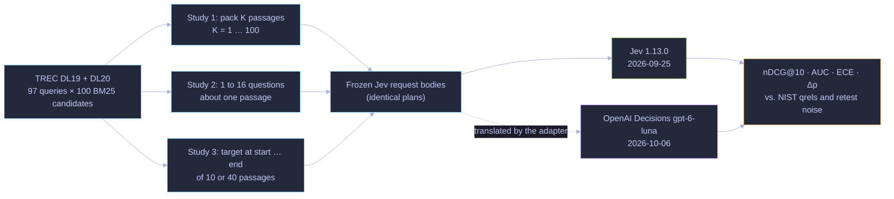
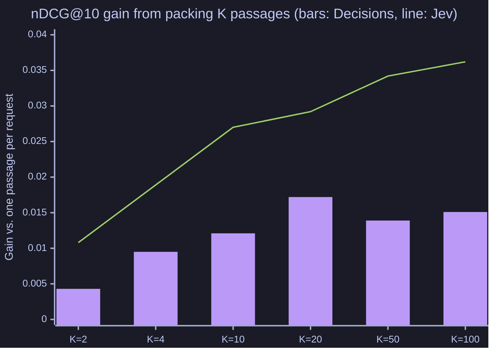

# Request shaping for decision models

**Question:** how should you shape a decision-model request? Pack many items into one state or send one at a time, ask many questions per request or one, and does it matter where the evidence sits in the state?

Three controlled studies on TREC DL passage relevance, with human labels. They ran first on TypeSafe Jev (`jev-1.13.0`, 2026-09-25) and were then re-run, every arm, on [OpenAI Decisions](#openai-decisions-re-run-2026-10-06) (`gpt-6-luna`, 2026-10-06). Every study uses the frozen relevance prompt from [`jev-vs-rerankers`](../jev-vs-rerankers/README.md):

1. **State packing** ([Jev report](results/state-packing-v1/REPORT.md), [Decisions report](results/state-packing-openai-decisions-v1/REPORT.md)): one passage per state compared with several passages sharing a state.
2. **Question fan-out** ([Jev](results/question-fanout-v1/REPORT.md), [Decisions](results/question-fanout-openai-decisions-v1/REPORT.md)): one question per request compared with several questions about the same state.
3. **Position in state** ([Jev](results/state-position-v1/REPORT.md), [Decisions](results/state-position-openai-decisions-v1/REPORT.md)): evidence at the beginning, middle, or end of the state.

**Status:** complete for both models. Design and the frozen as-run protocol: [SPEC.md](SPEC.md). Each study is its own Cobra CLI under `cmd/`. No LLM is involved anywhere; every model call is to a decision model. This experiment was developed under the name `jev-best-practices`.

## How it works



## Findings on Jev (frozen, 2026-09-25)

### 1. Packing same-query passages into one state helps ranking and cuts requests

- **Ranking quality:** putting K candidates for the same query into one state, with one question per passage, raised nDCG@10 steadily with K. The gain went from +0.011 (K = 2, not significant) to **+0.036 [+0.017, +0.055] at K = 100**, where all 100 candidates are in one request. It is significant after Holm correction for K ≥ 4.
- **Not a tie artifact:** Jev rounds probabilities to 0.01, but the gain holds (+0.041) when tied scores are ordered at random instead of by BM25.
- **Binary discrimination:** AUC (grade ≥ 2 vs. the rest) is statistically unchanged, at +0.006 [−0.003, +0.015].
- **Cost and speed:** requests fall K-fold. Input tokens per decision drop from 438 to 189, because the question is billed once per request instead of once per passage. At K = 100 the median request time per decision drops from 91 ms to 2 ms.
- **Distraction vs. fan-out:** the change comes from the other passages in the state, not from the extra questions. Asking about only one passage in the same packed state (`single-K`) gives the same probabilities as asking about all of them.
- **Neighbors pull scores down slightly:** four relevant neighbors lower a target's probability by 0.026 [0.017, 0.035] compared with four non-relevant neighbors, whatever the target's own label.
- **Order matters a little:** reversing a pack changes probabilities by a mean |Δp| of 0.041, about four times the retest noise of 0.009.
- **Referencing passages:** named keys (`passages.p007`) and quoted ids work about equally well. Bare indices (`passages[6]`) inflate probabilities (+0.014) and worsen calibration (ECE 0.188 vs. 0.169).
- **Mixing unrelated queries** (`cross-K`) still helps nDCG (+0.017 to +0.020) but inflates probabilities and worsens calibration (ECE 0.205 to 0.229 vs. 0.181).

### 2. Co-asked questions really are independent

Asking the target question alone, or alongside 2, 7, or 15 other questions, changed its probability by a mean |Δp| of 0.0093–0.0099. A plain retest of the solo request moves it by 0.0094, so the difference is indistinguishable from noise. Asking the three ordinal questions together does not make the answers more coherent (violations of direct ≤ useful ≤ related stay at about 2.5%). Fan-out is cheap: 16 questions cost 815 input tokens against 435 for one.

### 3. Position in state

**No "lost in the middle."** A target passage was moved through five positions among 9 or 39 off-topic filler passages; the middle was never worse than the start. Only the **end of the 40-passage state** was slightly worse (AUC −0.008 [−0.014, −0.003] for a pointed question, −0.009 [−0.017, −0.002] for a needle question). Putting the question field before the passages removed the end penalty and raised AUC a little (0.905 vs. 0.897) at some cost in calibration. Off-topic filler inflated non-relevant targets (mean p 0.40 alone to 0.42–0.49) while relevant ones stayed near 0.88.

### Noise floor

Re-sending byte-identical requests moved Jev probabilities by a mean |Δp| of 0.009, and about 1% of decisions crossed 0.5. A week apart, all 9,700 atomic request bodies were byte-identical and the answers matched as closely (|Δp| 0.008), so no model drift was visible.

## OpenAI Decisions re-run (2026-10-06)

**What changed and what was held fixed.** All three studies, every arm including each study's fresh baseline and retest, were re-run on OpenAI's [Decisions API](https://developers.openai.com/api/docs/guides/decisions) (`gpt-6-luna`, wire format `guide-2026-10-06`). Each request is the frozen Jev request body of the same job, translated by the [adapter](../openai-decisions-adapter/README.md): the state becomes the text `input` and each Noul question a `predicate` with the same name and instructions. The plans are identical (same plan hash, 100,672 requests, 401,710 questions), as are the seeds, subsets, metrics and bootstrap. Jev columns replay the frozen 2026-09-25 receipts; Jev was not re-run.

| Measure | Jev (frozen) | Decisions |
|---|---:|---:|
| Retest noise, mean \|Δp\| (2,000 re-sent requests per study) | 0.0094 | **0.0000** |
| Atomic, one passage per request: nDCG@10 / AUC (97 queries) | 0.6782 / 0.8931 | 0.6812 / 0.8748 |
| Packing gain in nDCG@10 at K = 100 (Holm-adjusted p) | +0.0362 [+0.0173, +0.0546] (0.002) | +0.0151 [−0.0077, +0.0386] (1.00) |
| ECE, atomic → K = 100 | 0.181 → 0.180 | 0.231 → **0.045** |
| Input tokens per decision, atomic → K = 100 | 438 → 189 | 316 → 312 |
| 16 co-asked questions: target mean \|Δp\| vs. solo | 0.0093–0.0098 | **0.0000** |
| Ordinal chain violated, useful > related (solo) | 2.75% | 20.35% |
| Reversing a 10-pack: mean \|Δp\| | 0.041 | 0.079 |
| Bare-index references, Δ AUC vs. atomic | +0.003 [−0.006, +0.012] | −0.021 [−0.034, −0.007] |
| End of a 40-passage state, pointed Δ AUC vs. middle | −0.008 [−0.014, −0.003] | +0.006 [−0.014, +0.024] |
| 40 passages, pointed AUC at the middle: question after → before passages | 0.897 → 0.905 | 0.850 → **0.899** |
| Needle question ("does any passage help?"), 40 passages, middle: AUC / mean p non-relevant | 0.898 / 0.47 | 0.828 / 0.61 |
| Refused questions | 0 | 46 of 401,710 |
| List cost of all three studies | $7.54 | $19.98 |



**What transfers and what does not.**

- **Decisions is deterministic.** All 4,000 retest decisions (Studies 1 and 2) came back identical, so every Decisions difference below is read against a zero noise floor rather than Jev's 0.009.
- **Fan-out is exactly independent on Decisions,** even more strictly than on Jev: adding 2 to 15 questions, related or not, first or last, left the target probability unchanged in every one of 2,000 items. It is not cheap, though: each extra question added about 140 input tokens (Jev about 25), so 16 questions cost 2,747 tokens against 312 for one.
- **Packing does not pay on Decisions.** Requests still fall K-fold, but input tokens per decision stay at about 312–316, so the cost does not drop. The ranking gain is smaller and not significant at any K (the largest is +0.017 at K = 20; Holm p ≥ 0.69). Packing lowers Decisions probabilities sharply (mean Δp −0.16 at K = 100), and because single-passage Decisions probabilities run high, that improves calibration (ECE 0.23 to 0.05). As on Jev, `single-K` matches `pack-K` exactly, so the state, not the extra questions, drives the change.
- **Order and references matter more on Decisions.** Reversing a pack moves probabilities twice as much as on Jev, and bare indices (`passages[6]`) cost 0.021 AUC; use named keys or ids.
- **Ordinal questions are less coherent on Decisions:** p(useful) exceeded p(related) on 20% of items (Jev 3%).
- **Position:** no "lost in the middle" on Decisions either, and no significant end penalty in AUC, although a relevant target's probability fell by 0.027 [0.004, 0.050] when moved from the middle to the end of 40 passages. **Putting the question before a long state helped Decisions much more than Jev** (pointed AUC 0.89–0.90 vs. 0.85–0.86, and better calibration). Needle questions inflated non-relevant targets on Decisions (mean p about 0.61–0.64), lowering AUC to 0.82–0.85.
- **Same-request agreement:** on the 9,700 atomic requests, Decisions and Jev probabilities correlate at r = 0.93 (mean |Δp| 0.089; 8.9% of decisions on opposite sides of 0.5), with Decisions AUC 0.875 vs. Jev 0.893.

**Refusals.** Decisions refused 46 of 401,710 questions: 45 unscored co-asked questions in the related fan-out pools (13 in `fan-8-rel-first`, 16 each in the two 16-question arms) and 1 scored passage in `ref-index-10`. No question was refused in Study 3. Refused questions are never retried or given a value; reports exclude them from every metric and tag affected rows.

**Cost and latency.** $19.98 at $0.10 per million input tokens (199.8M tokens; Jev billed 179.6M for the same requests at $0.042, $7.54): $6.98 state packing, $3.48 fan-out, $9.52 position. The median request took about 110 ms for one passage and 290 ms for a 100-question pack (2.9 ms per decision). 61 requests needed a transient retry; none failed.

**Practical guidance for `gpt-6-luna` Decisions, from this benchmark:** ask many questions per request when you need them (answers are independent and deterministic) but budget about 140 tokens per extra question; do not pack items for cost or ranking, only to cut request count; refer to items by name, never by index; put the question before a long state; prefer pointed questions to "does any item…" questions; and freeze your state layout, as with Jev.

**Caveats.** One model snapshot per provider, one task family (short web passages), 97 queries or a 20-query subset; Jev and Decisions ran 11 days apart; the prompts were written for Jev and not tuned for Decisions; Decisions probabilities are rounded to 0.01 and 6% of Study 1 decisions are exactly 0 or 1. Source-free numbers: [`results/openai-decisions-v1/`](results/openai-decisions-v1/README.md).

## Method

- **Data:** TREC DL19 (43 queries) and DL20 (54 queries), each with 100 BM25 candidates from the pinned RankLLM files, 9,700 items in total. Graded labels come from NIST qrels. Labels are used only for scoring and for building the Study 1 neighbor conditions; they never enter a prompt.
- **Subset:** Studies 2 and 3, and Study 1's retest and `single-K` arms, use a seeded 20-query subset (10 per year). Arm order is interleaved with a seeded shuffle.
- **Metrics:** nDCG@10 with linear gains (matching the frozen trec_eval-verified values for all 97 queries); AUC, Brier score and 10-bin equal-mass ECE against grade ≥ 2; Δp against the same item's fresh atomic probability.
- **Intervals:** 95% percentile bootstrap intervals, resampling queries within year. nDCG uses 10,000 replicates and item metrics 2,000. Holm correction covers each study's primary family.
- **Execution:** 16 workers. Jev ran at a client limit of 1,000 requests per minute; Decisions at 300 (fan-out) and 3,000 (packing, position). Up to four attempts per request on transport errors, 408, 429 and 5xx. Every receipt is kept, and each request is reserved before it is sent.

## Reproduce

Requires Go 1.27.1 or later. From this directory:

```sh
go test ./... && go vet ./...           # offline; data-dependent tests skip until prepare
go run ./cmd/state-packing prepare      # downloads pinned inputs, hash-verified, no model calls
go run ./cmd/state-packing plan         # request counts and conservative cost ceiling
go run ./cmd/state-packing smoke        # synthetic sanity check (paid, tiny)
go run ./cmd/state-packing run --budget 15
go run ./cmd/state-packing report       # offline replay of your receipts → REPORT.md
```

The same commands work for `question-fanout` (budget 8) and `state-position` (budget 25). Paid commands need `TYPESAFE_TOKEN` in the environment (or in `~/.secrets/keys.env`). `prepare` reuses `../jev-vs-rerankers/data` when it exists. Seven tests need the pinned inputs and skip until `prepare`; three of those also compare against the private frozen receipts and keep skipping in this distribution.

This folder contains the Jev code exactly as frozen for the 2026-09-25 run, with only the Go module path changed. The Decisions provider wiring for these CLIs is not part of this export and will be released later; the shared [adapter](../openai-decisions-adapter/README.md) is public. See [reproduction notes](../../REPRODUCTION.md#openai-decisions-re-runs).

## Evidence

Each `results/<study>-v1/REPORT.md` is the generated Jev report, and each `results/<study>-openai-decisions-v1/REPORT.md` the generated Decisions report with the frozen Jev columns beside it (the only edits for publication are the experiment identifier in the frontmatter and the adapter's path). [`results/openai-decisions-v1/summary.json`](results/openai-decisions-v1/README.md) holds the source-free numbers. Receipts are not distributed: request bodies contain MS MARCO passage text, and raw Decisions responses are provider outputs. Both can be regenerated from the pinned inputs and code.

## Limitations

- **Scope:** one version of each model, one task family (short web passages), and 97 queries, or 20 for the subset studies.
- **The packing results are benchmark-specific.** They are measured on BM25 candidate lists for TREC DL. Long chunks, or states full of irrelevant material, may behave differently.
- **Unjudged passages** count as zero gain in nDCG.
- **Some conditions are artificial by design:** the neighbor and haystack setups.
- **Study 2's question pools were drafted by Claude** from the Jev documentation, not by a domain expert.
